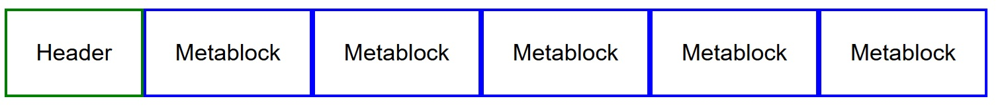
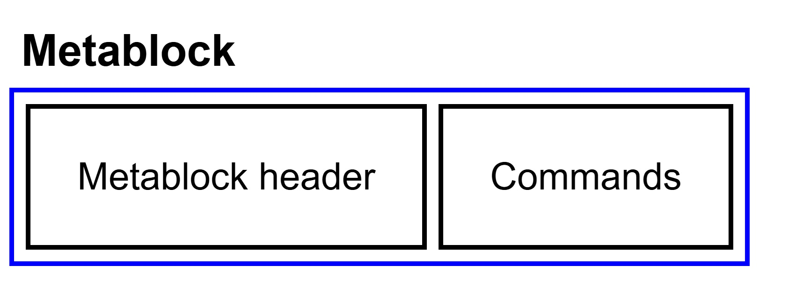

## О чём этот документ?

В этом документе представлен выжимка из RFC7932 https://datatracker.ietf.org/doc/html/rfc7932, описывающего алгоритм сжатия Brotli, вышедшего в 2015 году. Рассчитывается, что читатель знаком с базовой версией алгоритма LZ77 и с кодированием Хаффмана. Для краткости изложения опущены подробности о флагах и исключительных случаях.

## Краткий обзор  

Сжатые данные представляют собой <b>заголовок</b> и набор <b>метаблоков</b>. Каждый метаблок раскодируется в последовательность от 0 до 16MB. В заголовке содержится информация о размере скользящего окна. 



Метаблоки закодированы с помощью комбинации алгоритма LZ77 и кодирования Хаффмана. Результатом кодирования Хаффмана является <b>префиксный код</b>. Префиксные коды отдельных метаблоков независимы, но LZ77 может использовать ссылки на строки из предыдущего мета-блока
Метаблок состоит из заголовка и серии команд



В свою очередь каждая команда состоит из двух частей: 

1) последовательности литералов, что не удалось найти с помощью скользящего окна 
2) указатель на совпадающую строку (длина строки + сдвиг)
   
Важно понимать, что команда представляет собой прексный код, причём используется три категории префиксных кодов:

1) Для длины последовательности литералов и для длины строки копирования
2) Для литералов
3) Для сдвига

Информация, необходимая для расшифровки префиксного кода содержится в заголовке метаблока 

Давайте рассмотрим конкретный пример: 

`(IaC0, L0, L1, L2, D0)(IaC1, D1)(IaC2, L3, L4, D2)(IaC3, L5, D3)`

Итак, мы видим серию из 4-х комманд, разделённых скобками для наглядности

Важно упомянуть о типах блоков кода для каждой категории. Приведу сразу набор команд 
```
IaC0 L0 L1 LBlockSwitch(1, 3) L2 D0 IaC1 DBlockSwitch(1, 3) D1
IaCBlockSwitch(1, 2) IaC2 L3 L4 D2 IaC3 LBlockSwitch(0, 1) L5 D3
```
```
[IaC0, IaC1][IaC2, IaC3] <-- insert-and-copy: block types 0 and 1
[L0, L1][L2, L3, L4][L5] <-- literals: block types 0, 1, and 0
[D0][D1, D2, D3] <-- distances: block types 0 and 1
```
`xBlockSwitch(t, n)`  - меняет тип кода для блока категории X, t - тип кода (может быть от 0 до 255), n - количество
символов этого типа. Тип блока каждой категории начинается с 0

Зачем эти типы нужны? Дело в том, что в заголовке метаблока находится целое множество префиксных кодов. И для конкретного блока может применятся разный префиксный код, зависящий от двух параметров: 
- контектса блока
- типа блока
- 
Если с типом блока в целом понятно, то контекст зависит от категории блока. Так, для литералов - это последние два бита в расжатых данных. Для сдвигов - это длина строки копирования. Для IaC контекста нет.

## Подробнее о префиксных кодах 