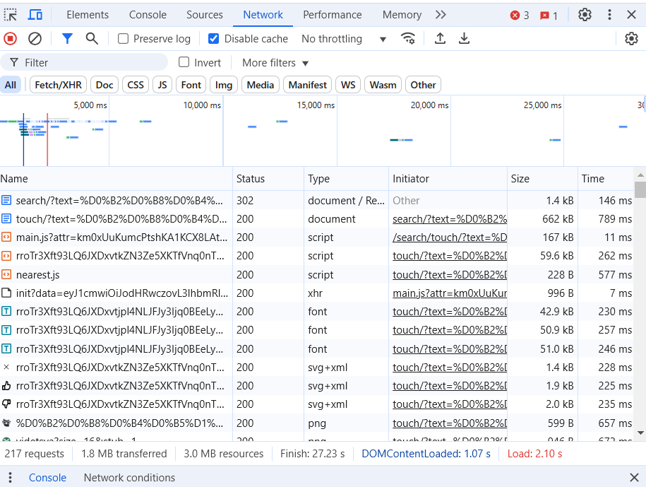
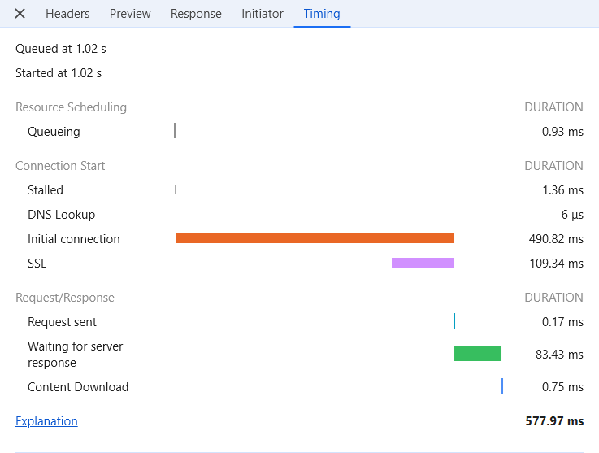

## Браузеры и JavaScript

На сегодняшний день существует два вида браузеров:

- Основанные на движке Chromium V8 от Google (https://github.com/v8/v8) такие, как Gooogle Chrome, Yandex Browser, Microsoft Edge и другие
- Firefox, использующий Quantum

Дело в том, что JavaScript, использующийся в веб приложениях, - скриптованный язык, существует спецификация ESMA Script (https://262.ecma-international.org/), в которой написано, что должен делать язык, но реализация не указана. Реализация фукнций языка ложится на разработчиков браузеров. Здесь, в отличие от Си или Java, не существует компиляторов или Java Virtual Machine. Разрабочики точно не знают, что происходит "под капотом".

Для получения информации о времени выполнения, скорости загрузки, использования памяти можно использовать инструменты разработчика (DevTools). Её можно открыть в любом браузере, нажав F12

## Какие функции предоставляет консоль разработчика

Реализации DevTools отличаются в зависимости от браузера. Но в целом, DevTools у браузеров на Chromium очень похожи.
Я буду брать примеры из Google Chrome

Нас интересуют две вкладки:

### Networks



На этой вкладке можно посмотреть все сетевые запросы, выполненные браузером на данной странице, узнать статус запроса, тип, размер ответа и общее время, потраченное на запрос,



Если нажать на конкретный запрос, можно будет узнать такие параметры, как

- Время, когда запрос был отправлен (время отсчитывается от момента перехода на сайт)
- Queueing Очередь . Браузер ставит запросы в очередь перед началом соединения и когда:
  Есть запросы с более высоким приоритетом. Приоритет запроса определяется такими факторами, как тип ресурса, а также его расположение в документе.
  Для этого источника уже открыто шесть TCP-соединений, что является пределом. (Применимо только к HTTP/1.0 и HTTP/1.1.)
  Браузер ненадолго выделяет место в дисковом кеше.
- Stalled Запрос мог быть остановлен после начала соединения по любой из причин, описанных в Queueing
- Initial connection, физическая удалённость сервера, временные затраты на TSL/SSL handshake, если используется HTTPs
- Время, затраченное, на отправку запроса
- Время ожидание ответа от сервера
- Сколько времени затрачено на загрузку содержимого запроса

Как можно заметить, по этим параметрам не удаётся опеределить время, затраченное на декодирование запроса

### Performance


Largest Contentful Paint (LCP) (https://web.dev/articles/lcp) сообщает о времени рендеринга самого большого изображения, текстового блока или видео,
видимого в окне просмотра, по отношению к моменту, когда пользователь впервые перешёл на страницу.

На этой вкладке мы так же можем применить throttling к процессору или к сети

Для сети существует несколько режимов:

#### 2. Low-end Mobile (регламентировано для 3G, медленное ограничение):

- Скорость загрузки (Download): 400 Kbps.
- Скорость отправки (Upload): 400 Kbps.
- Задержка (Latency): ~400 мс.

#### 3. Regular 3G

- Скорость загрузки (Download): 750 Kbps.
- Скорость отправки (Upload): 250 Kbps.
- Задержка (Latency): ~100 мс.

#### 4. Good 3G

- Скорость загрузки (Download): 1.5 Mbps.
- Скорость отправки (Upload): 750 Kbps.
- Задержка (Latency): ~40 мс.

Можно настроить и свою конфигурацию

#### Тротлинг процессора

Троттлинг процессора (CPU throttling) в DevTools используется для замедления работы процессора в целях эмуляции менее мощных устройств или реальных условий работы пользователей.
Это особенно полезно для тестирования производительности, чтобы понять, как ваш сайт или приложение будет работать на слабых устройствах,
таких как смартфоны, или в условиях высокой нагрузки.

<b> Непроверенная информация !</b>

<i> Тротлинг в DevTools реализован программно. Браузер замедляет выполнение базовых функций JavaScript (sort, map, for) в указанное число раз (4x, 6x, 20x).
Исходя из этого, можно предположить, что замедление CPU не отразиться на времени, затраченное на декодирование файлов
</i>

Также можно замерить, какое замедление процессора нужно применить для эмуляции мобильных устройств. На моём компьютере это оказалось от 2x (для среднего сегмента смартфонов) и 6x (для low сегмента).

## Постановка эксперимента

В файле со сравнением gzip и brotli, я сжимал самый большой файл проекта Dating App. 765кб -> 193кб.

Сделаем так:
загружаем файл main.js, далее выполняем запрос (fetch). Будем измерять время отправления запроса.

```
  <body>
    <script src="http://localhost:88/main.js" />
    <script>
      fetch("http://localhost:88/test");
    </script>
  </body>
```

Как происходит загрузка сайта в браузере:

1. Загружаем html документ
2. Парсим html документ
3. Встречаем `<script src="http://localhost:88/main.js" />`, что говорит нам: загрузи и исполни скрипт с адреса "http://localhost:88/main.js",
   дальше не пойдём, пока этот скрипт не загрузится. В это время как раз входит время, необходимое на скачивание декодирование.
   Скрипт я закомментировал, чтобы испортить измерения сторонние вычисления.
4. Дальше выполняем запрос на "http://localhost:88/test". Это служит в качестве маркера. Время отправки запроса мы и будем измерять.

Буду проводить замеры:

Network throttling, CPU throttling

- No Throttling, No Throttling (Неограниченная скорость интеренета, мощный процессор)
- fast 4g, No Throttling (Быстрый интернет, мощный процессор)
- No Throttling, 6x Throttling

Сравню найду время отправки запроса для сжатия brottli 11x и для файла без сжатия. В теории для 3-го случая может получится, что без сжатия будет быстрее,
так как не потребуется тратить время на декодировние.

Но т.к есть подозрения, что CPU throttling не влияет на время декодирования, проведу замеры на своём мобильном телефоне Xiaomi 9T PRO в локальной сети Wi-Fi (300 Mb/s).

Так же дополнительно отключил кеширование на стороне клиента с помощью заголовков "Cache-Control", "Pragma"

Как и в прошлый раз ограничиваю фоновые процессы. 20 замеров на каждую характеристику

Время test запроса в случае с телефоном измерялось на стороне сервера.

Результаты находятся в файле Измерения2.xlsx

## Вывод

Результаты измерений показали, что для статических файлов во всех случаях сжатия файлов либо существенно уменьшает время отклика?, либо не увеличивает его.
То есть для любых устройств сжатие статических файлов будет предпочтительно.
