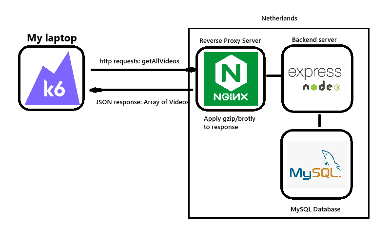

## Введение

В этом эксперименте созданы максимально правдободоные условия. Сервер находится на удалённом сервере в Нидерландах

Технические характеристики сервера:

- CPU 1 vCPU
- RAM 2 GB
- Storage 20 GB
- Speed 1200 Mbps

Технические характеристика моего ноутбука: 
- CPU 4 ядра
- RAM 8 GB
- Speed 50 Mbps

В качестве REST сервера используется Node.js express.js, обратный прокси сервер (сжатие http) Nginx

Логика следующая:

- клиент заходит на сайт
- скачивает статические файлы
- когда выполнится js код, выполнится get запрос на получение всех видео /videos/getAll
- сервер сделает запрос в базу данных
- возвращает ответ

Тестрирование проводится с помощью k6. Замеряются такие параметры, как:

- CPU usage
- Memory Usage
- Latency
- Availability

В зависимости от количества запросов в секунду (RPS)

Так выглядит ответ от сервера:

```
[
  {
    title: "Steel Horizon",
    description:
      '"Steel Horizon" is a captivating cinematic journey that explores the boundaries of imagination and reality. With stunning visuals and a compelling narrative, it draws viewers into a richly woven tale full of emotion, suspense, and intrigue. As the characters navigate through complex challenges, deep personal struggles, and unexpected twists, the story unfolds with intensity and grace. Crafted by visionary creators, the film blends elements of classic storytelling with modern cinematic techniques to create an unforgettable experience. Whether you\'re drawn to heartfelt drama, thrilling action, or thought-provoking ideas, this film offers a powerful reflection on humanity, resilience, and discovery.',
    number: 19,
    src_url: "https://cdn.example.com/videos/video_19.mp4",
    preview_url: "/previews/bearwolf.mp4",
    image_url: "/images/bearwolf2.jpg",
    studios: ["MegaPix"],
    tags: ["documentary", "action", "comedy"],
  },
]
```
## Схема проекта



## Эксперимент первый 

Нагрузка:
```
  stages: [
    { duration: "5s", target: 10 },
    { duration: "10s", target: 20 },
    { duration: "10s", target: 30 },
    { duration: "10s", target: 40 },
    { duration: "10s", target: 50 },
    { duration: "10s", target: 60 },
    { duration: "10s", target: 70 },
    { duration: "10s", target: 80 },
    { duration: "10s", target: 90 },
    { duration: "10s", target: 100 },
    { duration: "10s", target: 110 },
    { duration: "10s", target: 120 },
    { duration: "10s", target: 130 },
    { duration: "10s", target: 140 },
    { duration: "10s", target: 150 },
    { duration: "10s", target: 170 },
    { duration: "10s", target: 190 },
    { duration: "10s", target: 210 },
    { duration: "5s", target: 5 },
  ]
```

duration - время каждой стадии, target - кол-во одновременно активных пользователей
Каждый пользователь отправляет запрос на сервер, ждёт ответа, далее ждёт 1 секунду.


Результаты без сжатия:


Результаты с сжатием (gzip 9): 


## Эксперимент второй 

Нагрузка:
```
  stages: [
    { duration: "10s", target: 10 },
    { duration: "20s", target: 10 },
    { duration: "20s", target: 15 },
    { duration: "20s", target: 20 },
    { duration: "20s", target: 25 },
    { duration: "20s", target: 30 },
    { duration: "10s", target: 5 },
  ]
```


Результаты без сжатия:


Результаты с сжатием (gzip 9): 


## Зависимость CPU load, Network load от уровня сжатия (Без switcher)

Технические характеристики сервера:

- CPU 1 vCPU
- RAM 2 GB
- Storage 20 GB
- Speed 1200 Mbps

Технические характеристика моего ноутбука: 
- CPU 4 ядра
- RAM 8 GB
- Speed 100 Mbps

Ограничение на скорость создано искусственно с помощью настройки роутера QoS, максимальная скорость около 200 Mb/s
Ограничие скорости гарантирует постоянную полосу пропускания
На сервере отключены все построронние процессы. CPU используется только для:
- MySQL Database
- Backend server (Express.js)
- Обратный прокси сервер (Nginx)

Нагрузка создана с помощью k6:
```
  stages: [
    { duration: "5s", target: 10 },
    { duration: "10s", target: 20 },
    { duration: "10s", target: 30 },
    { duration: "10s", target: 40 },
    { duration: "10s", target: 50 },
    { duration: "10s", target: 60 },
    { duration: "10s", target: 70 },
    { duration: "10s", target: 80 },
    { duration: "10s", target: 90 },
    { duration: "10s", target: 100 },
    { duration: "10s", target: 110 },
    { duration: "10s", target: 120 },
    { duration: "10s", target: 130 },
    { duration: "10s", target: 140 },
    { duration: "10s", target: 150 },
    { duration: "10s", target: 170 },
    { duration: "10s", target: 190 },
    { duration: "10s", target: 210 },
    { duration: "5s", target: 5 },
  ]
```

В базе данных находится 400 видео, для тестирования используется Get запрос: 
`/video/getRecomendations/1`, который возвращает 100 рандомных видео из базы данных

Будет варироваться степень сжатия: 
- no compress
- gzip 1
- gzip 5
- gzip 9

При построении графиков использовалось сглаживание по трём точкам

`smoothing_x[i] = (x[i-1] + x[i] + x[i+1])/3`

Построены графики от времени

Результаты измерений

### No compress


### Gzip level 1


### Gzip level 5


### Gzip level 9


### Requests per seconds


### Cpu load


### Transmission speed


## Анализ полученных результатов

Как видно, использовние gzip заментно снизило нагрузку на сеть примерно в 20-30 раз, 
при этом даже при 80 МБ/c несжатого трафика, нагрузка на CPU из-за сжатия оказалась крайне малой, что при загрузке CPU на 100%,
показатель RPS остался на том же уровне.


