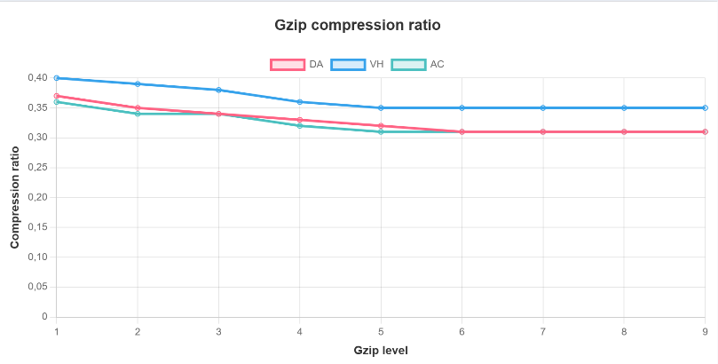
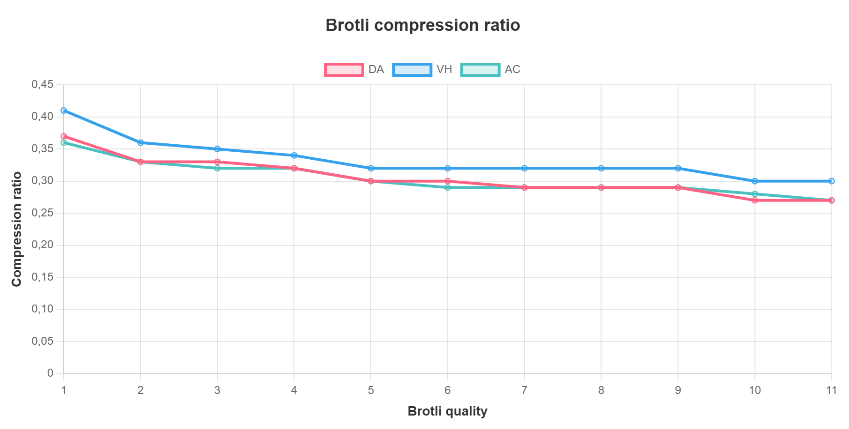
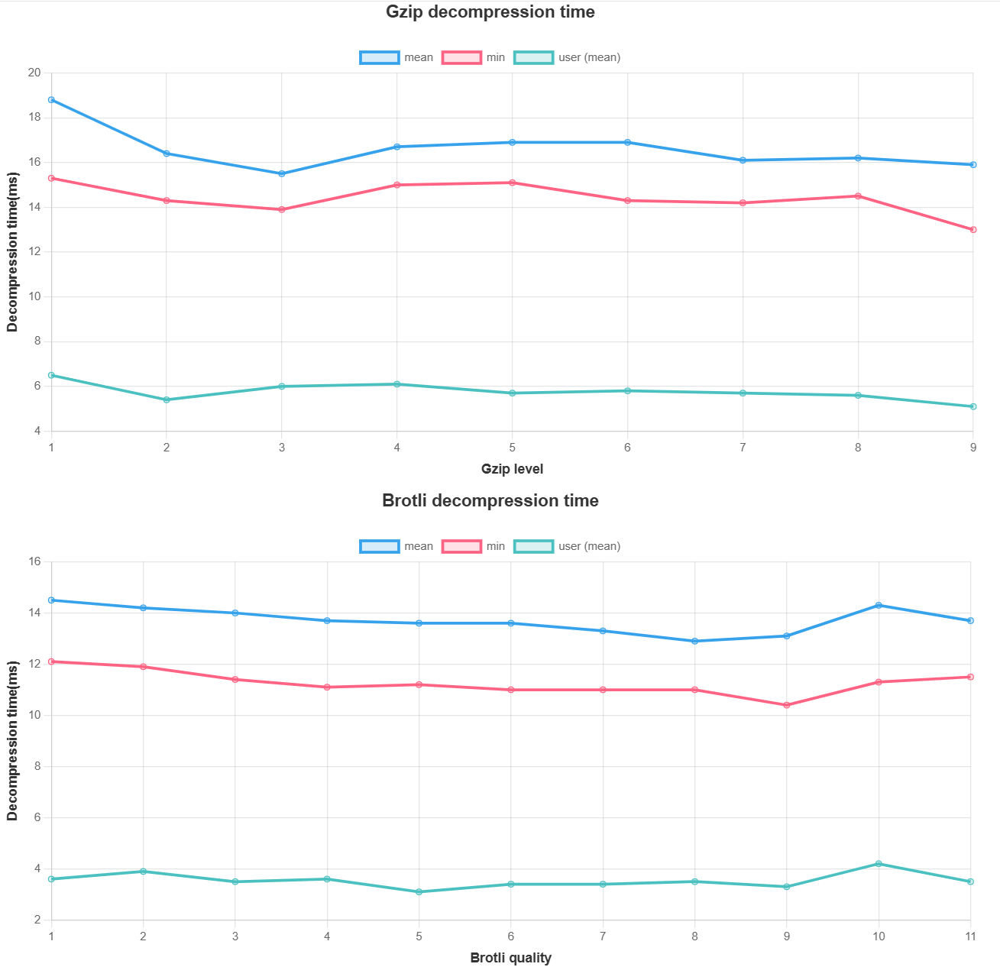

### Что измеряем

Для алгоритмов gzip, brotli будут измерены

1. Степень сжатия
2. Время сжатия
3. Время декомпрессии

В качестве исходных данным будут использованы минифицированные версии трёх веб-приложений:

1. Dating App (DA)
2. Videohosting (VH)
3. Angular conduit (AC)

### Технические характеристики устройства

Процессор: Intel(R) Core(TM) i5-10210U CPU @ 1.60GHz 2.11 GHz
Оперативная память: 8,00 ГБ
Операционная система: Windowws 11, версия 24H2, WSL Linux Ubuntu 20.04

### Условия проведения эксперимента, обработка данных

Для сжатия использована утилита gzipper (https://www.npmjs.com/package/gzipper) на node.js
Для декопрессии использованы утилиты gunzip, brotli на Linux

Для замеров времени декомпрессии использован hyperfine

При измерении скорости для каждой точки было проведено 20 измерений и применён метод усечённого среднего (10%)
Так же построены минимумы по времени

Для точности измерений были отключены фоновые процессы операционной системы

В веб-приложениях были удалены файлы с изображениями, т.к они уже сжаты с помощью специальных алгортмов для изображений (jpg, webp, avif)

### Изначальный размер

Изначальный размер приложений:

1. Dating App (DA) 999КБ
2. Videohosting (VH) 479КБ
3. Angular conduit (AC) 456КБ

### Измерение степени сжатия

Для Gzip

для Brotli

### Измерение времени сжатия

Замеры времени сжатия производились с помощью gzipper. Подряд вводились команды из консоли, после каждого сжатия, ожидание 1-2 секунды

Для Gzip

.png>)

Для Brotli

.png>)

Также построены графики минимального времени. Вероятно, эта интерпретация лучше защищена от помех

Для Gzip

.png>)

Для Brotli

.png>)

Было замечено, что gzipper тратит 160ms на пустой файл, вероятно это время требуется, чтобы запустить процесс, выделить память. Поэтому также построены графики за вычетом времени на накладные расходы

Для Gzip

.png>)

Для Brotli

.png>)

### Измерение времени декомпрессии

Измерения времени декомпрессии программой gunzip произведены на Linux 24.04. Для замеров использована утилита hyperfine.

Как видно, скорость декомпрессии почти не зависит от степени сжатия.
Так же видно, что в среднем brotli быстрее разжимает файлы чем gzip (имеются в виду конкретные программы)
