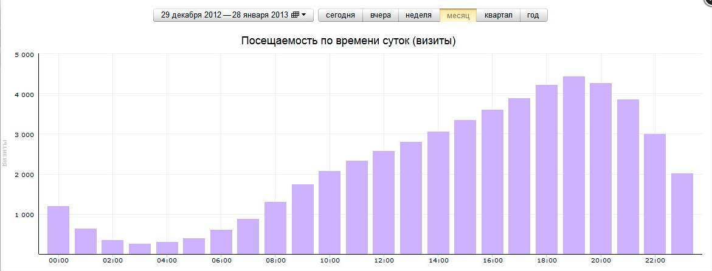
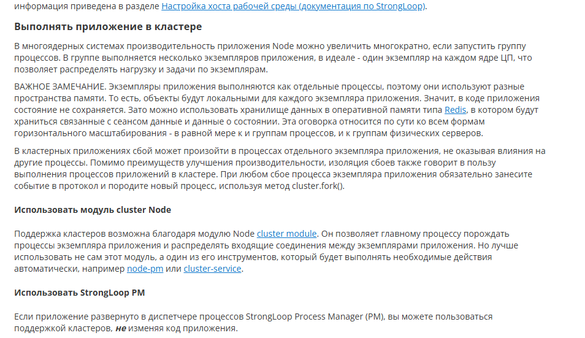

1. <b> Хотелось бы увидеть некоторое обоснование выбранных параметров нагрузочного тестирования, их "физический смысл". Какому режиму пользовательского поведения, работы, ещё какому-то понятному параметру соответствуют первый и второй сценарии работы? </b>

Физический смысл следующий: пользователь заходит на страницу, персонально для него подбираются рекомендации, используя случайный параметр (видео)
должны обновляться при перезагрузке сайта. После просмотра 1 видео пользователь кликает на следующее, ему снова подбираются рекомендации и так далее. Почему именно 100 видео? Около 100 видео, нужно для реализации корректного скроллинга. (В одной строке можно разместить 5 видео, На экране помещается 5 строк, хотим закрыть потребность в 3 скролах без подзагрузки, получаем 100 видео)

Первый сценарий с пиковой нагрузкой (17-21 час). Второй сценарий - низко-средняя нагрузка (0-8 часов)

1. <b> В нагрузочных тестах была достигнута нагрузка порядка 100 запросов в секунду. Это много или мало для сайта, который вы хотите построить? Хотелось бы увидеть какие-то ориентиры для сравнения. </b>

Попробуем оценить сверху количество просмотров в месяц, исходя из 100 запросов в секунду.
Считаем, что один запрос `getRecomendations` юзер выполняет после каждого просмотраю. Нагрузка на сервер постоянная, пиковая
Тогда, не учитывая нагрузку, вызванную потоком трафика для загрузки видео и прочими запросами, получим:

$100 * 60 * 60 * 24 * 30 = 259,2 * 10^6$ просмотров

Оценим кол-во видео трафика при такой нагрузке. Считаем, что в среднем пользователь смотрит видео 10 минут. То есть, один пользователь
выполняет запрос `getRecomendations` раз в 10 минут. Тогда, чтобы поддерживать RPS 100, нужно $1/600*x = 100$, где x - кол-во пользователей, смотрящих видео одновременно. Тогда $x = 6 * 10^3$. Считаем, что для просмотра видео в разрешении Full HD нужно около 8Мбит/сек, получаем 
видео трафик в $48Гб/c$. При таком видео трафике наша экономия в $0,1Гб/c$ может показаться не очень значительной, но если делегировать трансляицию видео другому сервису, экономия значительная. Главное, что мы снижаем общий Timing запроса (450ms vs 350ms).  

1. <b> В результатах (скриншоты на чёрном фоне) я не увидел дисперсии/стандартного отклонения. Насколько реально её получить? У любого из членов комиссии сразу же возникнет вопрос: "А какая сигма?". </b>

Предлагаю провести оценку дисперсиии поточечно уже для сглаженного графика. Провести 10 замеров, сгладить результаты и поточечно найти дисперсию.

- <b>А, и ещё. Это к обоснованию параметров тестирования. Помните, я говорил, что могут возникнуть вопросы о связи с теорией массового обслуживания? Вы думали над этим вопросом* </b>

Да, думал. Большинство простых аналитических моделей СМО получено при наличии простейшего потока требований.
Простейший поток - поток, удовлетворяющий требованиям стационарности, ординарности и отсутствия последействия.

<b>Свойство стационарности:</b> вероятность появления k событий на любом промежутке времени зависит только от числа k и от длительности t промежутка и не зависит от начала его отсчёта.

<b>Свойство ординарности:</b> вероятностью наступления за элементарный промежуток времени более одного события можно пренебречь по сравнению с вероятностью наступления за этот промежуток не более одного события (то есть вероятность одновременного появления двух и более событий равна нулю)

<b>Отсутствие последействия</b> – свойство потока, состоящее в
том, что для любых непересекающихся участков времени количество событий, попадающих на один из них, не зависит от того,
сколько событий попало на другие участки времени. Это свойство
означает, что события появляются независимо друг от друга.

В моём моделировании работы пользователей запрос - ожидание ответа - ожидание 1с - запрос... не выполняется требование на отсутствие последсивий
Если отбросить число последствий и описать как простейший поток.
Определим интенсивность потока, максимальное число запросов в очерели и максимальное время ожидания ответа.

Можно рассмотреть модели ТМО для СМО с ожиданием и очередью и найти условия на число пользователей для отказа.
https://repo.ssau.ru/bitstream/Uchebnye-izdaniya/Sistemy-i-seti-massovogo-obsluzhivaniya-91842/1/Романенко%20В.А.%20Системы%20и%20сети%20массового%20обслуживания%202021.pdf стр30

(СМО многоканальная, если запускать сервер как несколько процессов)

